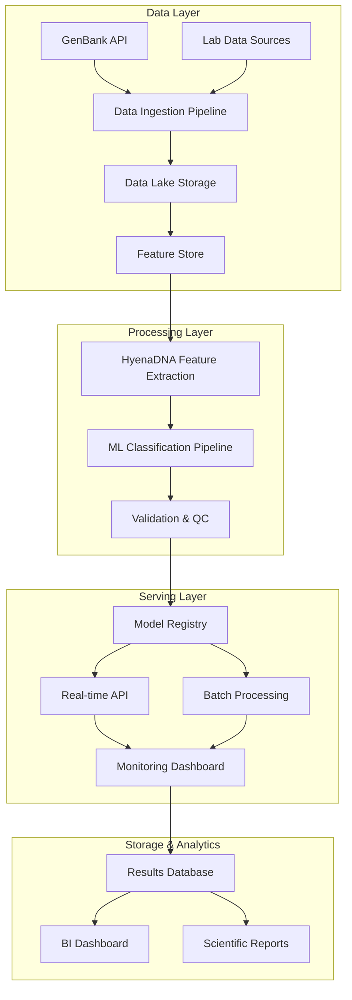

# HyenaDNA-WNV Implementation Guide

## 🚀 Production-Ready Implementation Plan

This comprehensive implementation guide provides enterprise-grade architecture and deployment strategies for the West Nile Virus genome classification system using HyenaDNA technology.

**Target Audience**: Senior Data Analysts, ML Engineers, DevOps Engineers, Bioinformatics Teams  
**Implementation Level**: Production-ready, scalable, enterprise deployment  
**Estimated Timeline**: 6-12 months for full deployment  

---

## 🏗️ Architecture Overview



---

## 📋 Phase 1: Data Infrastructure Setup

### 1.1 Data Architecture Design

**Infrastructure Requirements**
```yaml
Infrastructure:
  Cloud Provider: AWS/Azure/GCP
  Compute:
    - Training: 8x NVIDIA A100/H100 GPUs
    - Inference: Mixed CPU/GPU instances
    - Storage: S3/Azure Blob/GCS (100TB+)
    - Database: PostgreSQL + Redis + Elasticsearch
  
  Network:
    - VPC with private subnets
    - NAT Gateway for external API access
    - Load balancers for high availability
    - CDN for static content delivery

  Security:
    - IAM roles and policies
    - Encryption at rest and in transit
    - HIPAA/GDPR compliance
    - Audit logging and monitoring
```

**Data Lake Architecture**
```python
# data_lake_structure.py
"""
Data Lake Organization for Genomic Sequences
"""

class DataLakeStructure:
    def __init__(self):
        self.structure = {
            'raw/': {
                'genbank/': 'Original GenBank sequences',
                'lab_data/': 'Laboratory sequencing data',
                'external/': 'Third-party data sources',
                'metadata/': 'Associated metadata files'
            },
            'processed/': {
                'quality_filtered/': 'QC-passed sequences',
                'aligned/': 'Aligned sequence data',
                'features/': 'Extracted feature vectors',
                'embeddings/': 'HyenaDNA embeddings'
            },
            'curated/': {
                'training/': 'Training datasets',
                'validation/': 'Validation datasets',
                'test/': 'Test datasets',
                'benchmark/': 'Benchmark gold standards'
            },
            'results/': {
                'classifications/': 'Model predictions',
                'reports/': 'Analysis reports',
                'visualizations/': 'Generated plots and charts',
                'exports/': 'External data exports'
            }
        }
```

### 1.2 Data Governance Framework

**Quality Management System**
```python
# data_quality_framework.py
from typing import Dict, List, Optional
import pandas as pd
import numpy as np
from dataclasses import dataclass
from datetime import datetime

@dataclass
class QualityRule:
    name: str
    description: str
    validation_function: callable
    severity: str  # 'error', 'warning', 'info'
    threshold: Optional[float] = None

class GenomicDataQuality:
    def __init__(self):
        self.rules = [
            QualityRule(
                name="sequence_length",
                description="WNV genome should be ~11kb",
                validation_function=self._validate_length,
                severity="error",
                threshold=0.1  # 10% deviation allowed
            ),
            QualityRule(
                name="ambiguous_bases",
                description="Less than 5% N bases",
                validation_function=self._validate_ambiguous,
                severity="error",
                threshold=0.05
            ),
            QualityRule(
                name="gc_content",
                description="GC content within expected range",
                validation_function=self._validate_gc_content,
                severity="warning",
                threshold=0.15  # 15% deviation from mean
            )
        ]
        
    def validate_batch(self, sequences: List[str], metadata: pd.DataFrame) -> Dict:
        """Validate a batch of sequences against quality rules"""
        results = {
            'passed': [],
            'failed': [],
            'warnings': [],
            'summary': {}
        }
        
        for idx, seq in enumerate(sequences):
            seq_results = []
            for rule in self.rules:
                validation_result = rule.validation_function(seq, metadata.iloc[idx])
                if not validation_result['passed']:
                    seq_results.append({
                        'rule': rule.name,
                        'severity': rule.severity,
                        'message': validation_result['message']
                    })
            
            if any(r['severity'] == 'error' for r in seq_results):
                results['failed'].append({'index': idx, 'errors': seq_results})
            elif any(r['severity'] == 'warning' for r in seq_results):
                results['warnings'].append({'index': idx, 'warnings': seq_results})
            else:
                results['passed'].append(idx)
                
        return results
```

**Metadata Management System**
```sql
-- metadata_schema.sql
-- Standardized schema for West Nile Virus genomic metadata

CREATE TABLE wnv_sequences (
    sequence_id VARCHAR(50) PRIMARY KEY,
    genbank_accession VARCHAR(20) UNIQUE,
    sequence_data TEXT NOT NULL,
    sequence_length INTEGER,
    submission_date DATE,
    collection_date DATE,
    country VARCHAR(100),
    state_province VARCHAR(100),
    city VARCHAR(100),
    latitude DECIMAL(10,8),
    longitude DECIMAL(11,8),
    host VARCHAR(100),
    isolation_source VARCHAR(200),
    strain VARCHAR(100),
    lineage VARCHAR(20),
    sublineage VARCHAR(20),
    quality_score DECIMAL(5,3),
    gc_content DECIMAL(5,3),
    ambiguous_bases INTEGER,
    created_at TIMESTAMP DEFAULT CURRENT_TIMESTAMP,
    updated_at TIMESTAMP DEFAULT CURRENT_TIMESTAMP
);

CREATE INDEX idx_collection_date ON wnv_sequences(collection_date);
CREATE INDEX idx_location ON wnv_sequences(country, state_province);
CREATE INDEX idx_lineage ON wnv_sequences(lineage);
CREATE INDEX idx_quality ON wnv_sequences(quality_score);

CREATE TABLE sequence_features (
    sequence_id VARCHAR(50) REFERENCES wnv_sequences(sequence_id),
    feature_vector BYTEA,  -- Serialized feature vector
    embedding_version VARCHAR(20),
    extraction_date TIMESTAMP,
    PRIMARY KEY (sequence_id, embedding_version)
);

CREATE TABLE classification_results (
    result_id SERIAL PRIMARY KEY,
    sequence_id VARCHAR(50) REFERENCES wnv_sequences(sequence_id),
    model_version VARCHAR(20),
    predicted_lineage VARCHAR(20),
    confidence_score DECIMAL(5,4),
    prediction_date TIMESTAMP,
    validation_status VARCHAR(20)
);
```

---

## 🔬 Phase 2: ML Pipeline Implementation

### 2.1 Enhanced HyenaDNA Architecture

**Production Model Implementation**
```python
# enhanced_hyena_model.py
import torch
import torch.nn as nn
from transformers import AutoModel, AutoTokenizer
from typing import Dict, List, Optional, Tuple
import numpy as np
from torch.nn import functional as F

class ProductionHyenaDNA(nn.Module):
    """
    Production-ready HyenaDNA model with enhancements for WNV classification
    """
    
    def __init__(self, config):
        super().__init__()
        self.config = config
        
        # Core HyenaDNA backbone
        self.hyena_model = AutoModel.from_pretrained(
            "LongSafari/hyenadna-medium-450k-seqlen-hf",
            trust_remote_code=True
        )
        
        # Freeze backbone if using pretrained
        if config.freeze_backbone:
            for param in self.hyena_model.parameters():
                param.requires_grad = False
        
        # Enhanced feature extraction
        self.feature_dim = self.hyena_model.config.hidden_size
        
        # Multi-scale attention pooling
        self.attention_pool = AttentionPooling(self.feature_dim)
        
        # Multi-task classification heads
        self.lineage_classifier = nn.Sequential(
            nn.Linear(self.feature_dim, 512),
            nn.ReLU(),
            nn.Dropout(0.3),
            nn.Linear(512, len(config.lineage_classes))
        )
        
        self.geographic_classifier = nn.Sequential(
            nn.Linear(self.feature_dim, 256),
            nn.ReLU(),
            nn.Dropout(0.2),
            nn.Linear(256, len(config.geographic_regions))
        )
        
        # Uncertainty quantification
        self.uncertainty_head = nn.Linear(self.feature_dim, 1)
        
        # Initialize weights
        self._init_weights()
    
    def forward(self, 
                input_ids: torch.Tensor,
                attention_mask: Optional[torch.Tensor] = None,
                return_embeddings: bool = False) -> Dict[str, torch.Tensor]:
        """
        Forward pass with multi-task outputs
        """
        # Extract features from HyenaDNA
        outputs = self.hyena_model(
            input_ids=input_ids,
            attention_mask=attention_mask,
            output_hidden_states=True
        )
        
        # Get sequence representation
        sequence_output = outputs.last_hidden_state
        
        # Apply attention pooling
        pooled_features = self.attention_pool(sequence_output, attention_mask)
        
        # Multi-task predictions
        lineage_logits = self.lineage_classifier(pooled_features)
        geographic_logits = self.geographic_classifier(pooled_features)
        uncertainty = self.uncertainty_head(pooled_features)
        
        results = {
            'lineage_logits': lineage_logits,
            'geographic_logits': geographic_logits,
            'uncertainty': torch.sigmoid(uncertainty),
            'lineage_probs': F.softmax(lineage_logits, dim=-1),
            'geographic_probs': F.softmax(geographic_logits, dim=-1)
        }
        
        if return_embeddings:
            results['embeddings'] = pooled_features
            
        return results

class AttentionPooling(nn.Module):
    """
    Attention-based pooling for variable-length sequences
    """
    
    def __init__(self, hidden_size):
        super().__init__()
        self.attention = nn.Linear(hidden_size, 1)
        
    def forward(self, hidden_states, attention_mask=None):
        # Compute attention weights
        attention_weights = self.attention(hidden_states)
        
        if attention_mask is not None:
            attention_weights = attention_weights.masked_fill(
                attention_mask.unsqueeze(-1) == 0, -1e9
            )
        
        attention_weights = F.softmax(attention_weights, dim=1)
        
        # Weighted sum
        pooled = torch.sum(attention_weights * hidden_states, dim=1)
        
        return pooled
```

### 2.2 Training Pipeline

**Distributed Training Setup**
```python
# training_pipeline.py
import torch
import torch.distributed as dist
from torch.nn.parallel import DistributedDataParallel as DDP
from torch.utils.data.distributed import DistributedSampler
import wandb
import mlflow
from datetime import datetime
import json
import os

class WNVTrainingPipeline:
    def __init__(self, config):
        self.config = config
        self.setup_distributed()
        self.setup_logging()
        
    def setup_distributed(self):
        """Initialize distributed training"""
        if 'WORLD_SIZE' in os.environ:
            self.world_size = int(os.environ['WORLD_SIZE'])
            self.rank = int(os.environ['RANK'])
            self.local_rank = int(os.environ['LOCAL_RANK'])
            
            dist.init_process_group(backend='nccl')
            torch.cuda.set_device(self.local_rank)
        else:
            self.world_size = 1
            self.rank = 0
            self.local_rank = 0
    
    def setup_logging(self):
        """Setup experiment tracking"""
        if self.rank == 0:  # Only log from main process
            # MLflow for experiment tracking
            mlflow.start_run(
                experiment_id=self.config.experiment_id,
                run_name=f"wnv_hyena_{datetime.now().strftime('%Y%m%d_%H%M%S')}"
            )
            
            # Weights & Biases for visualization
            wandb.init(
                project="wnv-classification",
                config=self.config.__dict__,
                name=f"hyena_wnv_{datetime.now().strftime('%Y%m%d_%H%M%S')}"
            )
    
    def train(self):
        """Main training loop"""
        # Initialize model
        model = ProductionHyenaDNA(self.config)
        model.cuda(self.local_rank)
        
        # Wrap with DDP
        if self.world_size > 1:
            model = DDP(model, device_ids=[self.local_rank])
        
        # Initialize datasets
        train_dataset = WNVGenomeDataset(
            data_path=self.config.train_data_path,
            tokenizer=self.config.tokenizer,
            max_length=self.config.max_sequence_length
        )
        
        train_sampler = DistributedSampler(train_dataset) if self.world_size > 1 else None
        
        train_loader = torch.utils.data.DataLoader(
            train_dataset,
            batch_size=self.config.batch_size,
            sampler=train_sampler,
            num_workers=self.config.num_workers,
            pin_memory=True
        )
        
        # Initialize optimizer and scheduler
        optimizer = torch.optim.AdamW(
            model.parameters(),
            lr=self.config.learning_rate,
            weight_decay=self.config.weight_decay
        )
        
        scheduler = torch.optim.lr_scheduler.CosineAnnealingWarmRestarts(
            optimizer,
            T_0=self.config.scheduler_t0,
            T_mult=2,
            eta_min=1e-6
        )
        
        # Mixed precision training
        scaler = torch.cuda.amp.GradScaler()
        
        # Training loop
        for epoch in range(self.config.num_epochs):
            if train_sampler:
                train_sampler.set_epoch(epoch)
            
            model.train()
            total_loss = 0
            num_batches = len(train_loader)
            
            for batch_idx, batch in enumerate(train_loader):
                optimizer.zero_grad()
                
                # Move to device
                input_ids = batch['input_ids'].cuda(self.local_rank)
                attention_mask = batch['attention_mask'].cuda(self.local_rank)
                lineage_labels = batch['lineage_labels'].cuda(self.local_rank)
                geographic_labels = batch['geographic_labels'].cuda(self.local_rank)
                
                # Forward pass with mixed precision
                with torch.cuda.amp.autocast():
                    outputs = model(input_ids, attention_mask)
                    
                    # Multi-task loss
                    lineage_loss = F.cross_entropy(
                        outputs['lineage_logits'], lineage_labels
                    )
                    geographic_loss = F.cross_entropy(
                        outputs['geographic_logits'], geographic_labels
                    )
                    
                    # Uncertainty regularization
                    uncertainty_loss = torch.mean(outputs['uncertainty'])
                    
                    total_loss = (
                        self.config.lineage_weight * lineage_loss +
                        self.config.geographic_weight * geographic_loss +
                        self.config.uncertainty_weight * uncertainty_loss
                    )
                
                # Backward pass
                scaler.scale(total_loss).backward()
                scaler.step(optimizer)
                scaler.update()
                scheduler.step()
                
                # Logging
                if self.rank == 0 and batch_idx % self.config.log_interval == 0:
                    self.log_metrics({
                        'epoch': epoch,
                        'batch': batch_idx,
                        'total_loss': total_loss.item(),
                        'lineage_loss': lineage_loss.item(),
                        'geographic_loss': geographic_loss.item(),
                        'uncertainty_loss': uncertainty_loss.item(),
                        'learning_rate': scheduler.get_last_lr()[0]
                    })
            
            # Validation
            if epoch % self.config.validation_interval == 0:
                val_metrics = self.validate(model)
                if self.rank == 0:
                    self.log_metrics(val_metrics)
    
    def validate(self, model):
        """Validation loop"""
        model.eval()
        val_dataset = WNVGenomeDataset(
            data_path=self.config.val_data_path,
            tokenizer=self.config.tokenizer,
            max_length=self.config.max_sequence_length
        )
        
        val_loader = torch.utils.data.DataLoader(
            val_dataset,
            batch_size=self.config.batch_size,
            num_workers=self.config.num_workers,
            pin_memory=True
        )
        
        total_correct = 0
        total_samples = 0
        
        with torch.no_grad():
            for batch in val_loader:
                input_ids = batch['input_ids'].cuda(self.local_rank)
                attention_mask = batch['attention_mask'].cuda(self.local_rank)
                lineage_labels = batch['lineage_labels'].cuda(self.local_rank)
                
                outputs = model(input_ids, attention_mask)
                predictions = torch.argmax(outputs['lineage_logits'], dim=-1)
                
                total_correct += (predictions == lineage_labels).sum().item()
                total_samples += lineage_labels.size(0)
        
        accuracy = total_correct / total_samples
        return {'val_accuracy': accuracy}
    
    def log_metrics(self, metrics):
        """Log metrics to tracking services"""
        # MLflow
        for key, value in metrics.items():
            mlflow.log_metric(key, value)
        
        # Weights & Biases
        wandb.log(metrics)
```

---

## 🚀 Phase 3: Production Deployment

### 3.1 Model Serving Infrastructure

**FastAPI Inference Service**
```python
# inference_api.py
from fastapi import FastAPI, HTTPException, BackgroundTasks
from fastapi.middleware.cors import CORSMiddleware
from pydantic import BaseModel, Field
import torch
import asyncio
import redis
import json
import hashlib
from typing import List, Optional, Dict
import logging
from prometheus_client import Counter, Histogram, start_http_server
import time

# Metrics
REQUEST_COUNT = Counter('wnv_classification_requests_total', 'Total classification requests')
REQUEST_DURATION = Histogram('wnv_classification_duration_seconds', 'Request duration')
PREDICTION_CONFIDENCE = Histogram('wnv_prediction_confidence', 'Prediction confidence scores')

# Pydantic models
class GenomeSequence(BaseModel):
    sequence_id: str = Field(..., description="Unique identifier for the sequence")
    sequence: str = Field(..., description="Genomic sequence (A,C,G,T,N)")
    metadata: Optional[Dict] = Field(None, description="Optional metadata")

class ClassificationRequest(BaseModel):
    sequences: List[GenomeSequence]
    return_embeddings: bool = Field(False, description="Return feature embeddings")
    confidence_threshold: float = Field(0.5, description="Minimum confidence threshold")

class ClassificationResult(BaseModel):
    sequence_id: str
    predicted_lineage: str
    confidence: float
    geographic_prediction: Optional[str] = None
    uncertainty_score: float
    processing_time: float
    embeddings: Optional[List[float]] = None

class BatchClassificationResponse(BaseModel):
    results: List[ClassificationResult]
    total_processed: int
    processing_time: float
    model_version: str

class WNVInferenceService:
    def __init__(self):
        self.model = None
        self.tokenizer = None
        self.device = torch.device("cuda" if torch.cuda.is_available() else "cpu")
        self.redis_client = redis.Redis(host='localhost', port=6379, db=0)
        self.model_version = "v1.0.0"
        
        # Load model
        self.load_model()
        
        # Setup logging
        logging.basicConfig(level=logging.INFO)
        self.logger = logging.getLogger(__name__)
    
    def load_model(self):
        """Load the trained model"""
        try:
            # Load from model registry (MLflow, etc.)
            model_path = "models/production/wnv_hyena_v1.0.0"
            self.model = torch.load(f"{model_path}/model.pt", map_location=self.device)
            self.model.eval()
            
            # Load tokenizer
            with open(f"{model_path}/tokenizer_config.json", 'r') as f:
                tokenizer_config = json.load(f)
            
            self.logger.info(f"Model loaded successfully: {self.model_version}")
            
        except Exception as e:
            self.logger.error(f"Failed to load model: {e}")
            raise
    
    def preprocess_sequence(self, sequence: str) -> torch.Tensor:
        """Preprocess genomic sequence for model input"""
        # Tokenize sequence (A:0, C:1, G:2, T:3, N:4)
        token_map = {'A': 0, 'C': 1, 'G': 2, 'T': 3, 'N': 4}
        
        # Convert to tokens
        tokens = [token_map.get(base.upper(), 4) for base in sequence]
        
        # Pad or truncate to model max length
        max_length = 11000
        if len(tokens) < max_length:
            tokens.extend([4] * (max_length - len(tokens)))  # Pad with N tokens
        else:
            tokens = tokens[:max_length]  # Truncate
        
        return torch.tensor(tokens, dtype=torch.long)
    
    async def classify_batch(self, request: ClassificationRequest) -> BatchClassificationResponse:
        """Classify a batch of sequences"""
        start_time = time.time()
        results = []
        
        try:
            # Preprocess all sequences
            input_tensors = []
            for seq_data in request.sequences:
                tensor = self.preprocess_sequence(seq_data.sequence)
                input_tensors.append(tensor)
            
            # Stack into batch
            batch_input = torch.stack(input_tensors).to(self.device)
            
            # Generate predictions
            with torch.no_grad():
                outputs = self.model(
                    input_ids=batch_input,
                    return_embeddings=request.return_embeddings
                )
            
            # Process results
            for i, seq_data in enumerate(request.sequences):
                seq_start_time = time.time()
                
                # Extract predictions
                lineage_probs = outputs['lineage_probs'][i]
                geographic_probs = outputs['geographic_probs'][i]
                uncertainty = outputs['uncertainty'][i].item()
                
                # Get top prediction
                lineage_idx = torch.argmax(lineage_probs).item()
                confidence = lineage_probs[lineage_idx].item()
                
                # Check confidence threshold
                if confidence < request.confidence_threshold:
                    predicted_lineage = "UNCERTAIN"
                else:
                    predicted_lineage = self.idx_to_lineage(lineage_idx)
                
                # Geographic prediction
                geo_idx = torch.argmax(geographic_probs).item()
                geographic_prediction = self.idx_to_region(geo_idx)
                
                # Embeddings if requested
                embeddings = None
                if request.return_embeddings:
                    embeddings = outputs['embeddings'][i].cpu().numpy().tolist()
                
                result = ClassificationResult(
                    sequence_id=seq_data.sequence_id,
                    predicted_lineage=predicted_lineage,
                    confidence=confidence,
                    geographic_prediction=geographic_prediction,
                    uncertainty_score=uncertainty,
                    processing_time=time.time() - seq_start_time,
                    embeddings=embeddings
                )
                
                results.append(result)
                
                # Update metrics
                PREDICTION_CONFIDENCE.observe(confidence)
            
            total_time = time.time() - start_time
            REQUEST_DURATION.observe(total_time)
            REQUEST_COUNT.inc()
            
            return BatchClassificationResponse(
                results=results,
                total_processed=len(results),
                processing_time=total_time,
                model_version=self.model_version
            )
            
        except Exception as e:
            self.logger.error(f"Classification error: {e}")
            raise HTTPException(status_code=500, detail=str(e))
    
    def idx_to_lineage(self, idx: int) -> str:
        """Convert model output index to lineage name"""
        lineage_map = {0: "Lineage_1a", 1: "Lineage_1b", 2: "Lineage_2", 3: "Lineage_3"}
        return lineage_map.get(idx, "Unknown")
    
    def idx_to_region(self, idx: int) -> str:
        """Convert model output index to geographic region"""
        region_map = {0: "North_America", 1: "Europe", 2: "Africa", 3: "Asia"}
        return region_map.get(idx, "Unknown")

# FastAPI app
app = FastAPI(
    title="WNV Genome Classification API",
    description="Production API for West Nile Virus genome classification using HyenaDNA",
    version="1.0.0"
)

# CORS middleware
app.add_middleware(
    CORSMiddleware,
    allow_origins=["*"],
    allow_credentials=True,
    allow_methods=["*"],
    allow_headers=["*"],
)

# Initialize service
inference_service = WNVInferenceService()

@app.on_event("startup")
async def startup_event():
    # Start metrics server
    start_http_server(8001)
    
@app.post("/classify", response_model=BatchClassificationResponse)
async def classify_sequences(request: ClassificationRequest):
    """Classify genomic sequences"""
    return await inference_service.classify_batch(request)

@app.get("/health")
async def health_check():
    """Health check endpoint"""
    return {
        "status": "healthy",
        "model_version": inference_service.model_version,
        "device": str(inference_service.device)
    }

@app.get("/metrics")
async def get_metrics():
    """Get service metrics"""
    return {
        "total_requests": REQUEST_COUNT._value.get(),
        "model_version": inference_service.model_version
    }

if __name__ == "__main__":
    import uvicorn
    uvicorn.run(app, host="0.0.0.0", port=8000)
```

### 3.2 Monitoring and Observability

**Comprehensive Monitoring Stack**
```python
# monitoring_system.py
import logging
import psutil
import torch
import numpy as np
from datetime import datetime, timedelta
import pandas as pd
from typing import Dict, List, Optional
import json
import boto3
from dataclasses import dataclass

@dataclass
class SystemMetrics:
    timestamp: datetime
    cpu_usage: float
    memory_usage: float
    gpu_usage: Optional[float]
    gpu_memory: Optional[float]
    disk_usage: float
    network_io: Dict[str, float]

@dataclass
class ModelMetrics:
    timestamp: datetime
    predictions_per_second: float
    average_confidence: float
    low_confidence_rate: float
    error_rate: float
    response_time_p95: float
    model_version: str

class WNVMonitoringSystem:
    def __init__(self, config):
        self.config = config
        self.logger = logging.getLogger(__name__)
        
        # Metrics storage
        self.system_metrics = []
        self.model_metrics = []
        self.prediction_log = []
        
        # Alerting thresholds
        self.thresholds = {
            'cpu_usage': 80.0,
            'memory_usage': 85.0,
            'gpu_usage': 90.0,
            'error_rate': 0.05,
            'low_confidence_rate': 0.20,
            'response_time_p95': 2.0
        }
        
        # AWS CloudWatch client
        if config.use_cloudwatch:
            self.cloudwatch = boto3.client('cloudwatch')
    
    def collect_system_metrics(self) -> SystemMetrics:
        """Collect system performance metrics"""
        # CPU and Memory
        cpu_usage = psutil.cpu_percent(interval=1)
        memory = psutil.virtual_memory()
        memory_usage = memory.percent
        
        # Disk usage
        disk = psutil.disk_usage('/')
        disk_usage = disk.percent
        
        # Network I/O
        network = psutil.net_io_counters()
        network_io = {
            'bytes_sent': network.bytes_sent,
            'bytes_recv': network.bytes_recv
        }
        
        # GPU metrics (if available)
        gpu_usage = None
        gpu_memory = None
        if torch.cuda.is_available():
            try:
                import pynvml
                pynvml.nvmlInit()
                handle = pynvml.nvmlDeviceGetHandleByIndex(0)
                
                # GPU utilization
                gpu_util = pynvml.nvmlDeviceGetUtilizationRates(handle)
                gpu_usage = gpu_util.gpu
                
                # GPU memory
                mem_info = pynvml.nvmlDeviceGetMemoryInfo(handle)
                gpu_memory = (mem_info.used / mem_info.total) * 100
                
            except ImportError:
                pass
        
        metrics = SystemMetrics(
            timestamp=datetime.now(),
            cpu_usage=cpu_usage,
            memory_usage=memory_usage,
            gpu_usage=gpu_usage,
            gpu_memory=gpu_memory,
            disk_usage=disk_usage,
            network_io=network_io
        )
        
        self.system_metrics.append(metrics)
        return metrics
    
    def collect_model_metrics(self, prediction_results: List[Dict]) -> ModelMetrics:
        """Collect model performance metrics"""
        if not prediction_results:
            return None
        
        # Calculate metrics
        confidences = [r['confidence'] for r in prediction_results]
        response_times = [r['processing_time'] for r in prediction_results]
        errors = [r for r in prediction_results if 'error' in r]
        
        avg_confidence = np.mean(confidences)
        low_confidence_rate = sum(1 for c in confidences if c < 0.7) / len(confidences)
        error_rate = len(errors) / len(prediction_results)
        response_time_p95 = np.percentile(response_times, 95)
        predictions_per_second = len(prediction_results) / sum(response_times)
        
        metrics = ModelMetrics(
            timestamp=datetime.now(),
            predictions_per_second=predictions_per_second,
            average_confidence=avg_confidence,
            low_confidence_rate=low_confidence_rate,
            error_rate=error_rate,
            response_time_p95=response_time_p95,
            model_version=self.config.model_version
        )
        
        self.model_metrics.append(metrics)
        return metrics
    
    def check_alerts(self, system_metrics: SystemMetrics, model_metrics: ModelMetrics):
        """Check for alert conditions"""
        alerts = []
        
        # System alerts
        if system_metrics.cpu_usage > self.thresholds['cpu_usage']:
            alerts.append({
                'type': 'system',
                'severity': 'warning',
                'message': f"High CPU usage: {system_metrics.cpu_usage:.1f}%"
            })
        
        if system_metrics.memory_usage > self.thresholds['memory_usage']:
            alerts.append({
                'type': 'system',
                'severity': 'warning',
                'message': f"High memory usage: {system_metrics.memory_usage:.1f}%"
            })
        
        if system_metrics.gpu_usage and system_metrics.gpu_usage > self.thresholds['gpu_usage']:
            alerts.append({
                'type': 'system',
                'severity': 'warning',
                'message': f"High GPU usage: {system_metrics.gpu_usage:.1f}%"
            })
        
        # Model alerts
        if model_metrics:
            if model_metrics.error_rate > self.thresholds['error_rate']:
                alerts.append({
                    'type': 'model',
                    'severity': 'critical',
                    'message': f"High error rate: {model_metrics.error_rate:.3f}"
                })
            
            if model_metrics.low_confidence_rate > self.thresholds['low_confidence_rate']:
                alerts.append({
                    'type': 'model',
                    'severity': 'warning',
                    'message': f"High low-confidence rate: {model_metrics.low_confidence_rate:.3f}"
                })
            
            if model_metrics.response_time_p95 > self.thresholds['response_time_p95']:
                alerts.append({
                    'type': 'model',
                    'severity': 'warning',
                    'message': f"Slow response time: {model_metrics.response_time_p95:.2f}s"
                })
        
        # Send alerts
        for alert in alerts:
            self.send_alert(alert)
    
    def send_alert(self, alert: Dict):
        """Send alert notification"""
        self.logger.warning(f"ALERT: {alert['message']}")
        
        # Send to monitoring service (Slack, PagerDuty, etc.)
        if self.config.slack_webhook:
            self._send_slack_alert(alert)
        
        # Store in database for tracking
        self._store_alert(alert)
    
    def generate_dashboard_data(self) -> Dict:
        """Generate data for monitoring dashboard"""
        # Recent system metrics
        recent_system = self.system_metrics[-100:] if self.system_metrics else []
        recent_model = self.model_metrics[-100:] if self.model_metrics else []
        
        return {
            'system_metrics': {
                'cpu_usage': [m.cpu_usage for m in recent_system],
                'memory_usage': [m.memory_usage for m in recent_system],
                'gpu_usage': [m.gpu_usage for m in recent_system if m.gpu_usage],
                'timestamps': [m.timestamp.isoformat() for m in recent_system]
            },
            'model_metrics': {
                'predictions_per_second': [m.predictions_per_second for m in recent_model],
                'average_confidence': [m.average_confidence for m in recent_model],
                'error_rate': [m.error_rate for m in recent_model],
                'response_time': [m.response_time_p95 for m in recent_model],
                'timestamps': [m.timestamp.isoformat() for m in recent_model]
            },
            'summary': {
                'total_predictions': len(self.prediction_log),
                'current_model_version': self.config.model_version,
                'uptime': self._calculate_uptime(),
                'last_updated': datetime.now().isoformat()
            }
        }
```

### 3.3 Automated Data Pipeline

**Production ETL Pipeline**
```python
# production_pipeline.py
import apache_beam as beam
from apache_beam.options.pipeline_options import PipelineOptions
import pandas as pd
import numpy as np
from Bio import SeqIO
from typing import Dict, List, Tuple, Optional
import logging
from datetime import datetime, timedelta
import json

class GenBankDataExtractor(beam.DoFn):
    """Extract and validate sequences from GenBank"""
    
    def __init__(self):
        self.quality_filters = {
            'min_length': 10000,
            'max_length': 12000,
            'max_ambiguous_bases': 0.05
        }
    
    def process(self, element):
        """Process GenBank record"""
        try:
            record_id, sequence, metadata = element
            
            # Quality checks
            if not self._passes_quality_check(sequence):
                yield beam.pvalue.TaggedOutput('rejected', {
                    'record_id': record_id,
                    'reason': 'quality_check_failed',
                    'timestamp': datetime.now().isoformat()
                })
                return
            
            # Extract features
            features = self._extract_sequence_features(sequence)
            
            yield {
                'record_id': record_id,
                'sequence': sequence,
                'metadata': metadata,
                'features': features,
                'processing_timestamp': datetime.now().isoformat()
            }
            
        except Exception as e:
            logging.error(f"Error processing {record_id}: {e}")
            yield beam.pvalue.TaggedOutput('errors', {
                'record_id': record_id,
                'error': str(e),
                'timestamp': datetime.now().isoformat()
            })
    
    def _passes_quality_check(self, sequence: str) -> bool:
        """Check if sequence passes quality filters"""
        # Length check
        if not (self.quality_filters['min_length'] <= len(sequence) <= self.quality_filters['max_length']):
            return False
        
        # Ambiguous bases check
        n_count = sequence.count('N') + sequence.count('n')
        if n_count / len(sequence) > self.quality_filters['max_ambiguous_bases']:
            return False
        
        return True
    
    def _extract_sequence_features(self, sequence: str) -> Dict:
        """Extract basic sequence features"""
        seq_upper = sequence.upper()
        length = len(sequence)
        
        return {
            'length': length,
            'gc_content': (seq_upper.count('G') + seq_upper.count('C')) / length,
            'n_content': seq_upper.count('N') / length,
            'dinucleotide_freqs': self._calculate_dinucleotide_freqs(seq_upper)
        }
    
    def _calculate_dinucleotide_freqs(self, sequence: str) -> Dict[str, float]:
        """Calculate dinucleotide frequencies"""
        dinucs = ['AA', 'AC', 'AG', 'AT', 'CA', 'CC', 'CG', 'CT',
                  'GA', 'GC', 'GG', 'GT', 'TA', 'TC', 'TG', 'TT']
        
        counts = {dinuc: 0 for dinuc in dinucs}
        total = len(sequence) - 1
        
        for i in range(total):
            dinuc = sequence[i:i+2]
            if dinuc in counts:
                counts[dinuc] += 1
        
        return {dinuc: count/total for dinuc, count in counts.items()}

class HyenaDNAFeatureExtractor(beam.DoFn):
    """Extract HyenaDNA features using the trained model"""
    
    def __init__(self, model_path: str):
        self.model_path = model_path
        self.model = None
        self.tokenizer = None
    
    def setup(self):
        """Initialize model (called once per worker)"""
        import torch
        self.model = torch.load(self.model_path, map_location='cpu')
        self.model.eval()
    
    def process(self, element):
        """Extract features from sequence"""
        try:
            # Tokenize sequence
            tokens = self._tokenize_sequence(element['sequence'])
            
            # Extract features
            with torch.no_grad():
                features = self.model(tokens, return_embeddings=True)['embeddings']
                features_np = features.numpy()
            
            yield {
                **element,
                'hyena_features': features_np.tolist(),
                'feature_extraction_timestamp': datetime.now().isoformat()
            }
            
        except Exception as e:
            logging.error(f"Feature extraction error for {element['record_id']}: {e}")
            yield beam.pvalue.TaggedOutput('extraction_errors', {
                'record_id': element['record_id'],
                'error': str(e),
                'timestamp': datetime.now().isoformat()
            })
    
    def _tokenize_sequence(self, sequence: str) -> torch.Tensor:
        """Convert sequence to tokens"""
        token_map = {'A': 0, 'C': 1, 'G': 2, 'T': 3, 'N': 4}
        tokens = [token_map.get(base.upper(), 4) for base in sequence]
        
        # Pad/truncate to fixed length
        max_length = 11000
        if len(tokens) < max_length:
            tokens.extend([4] * (max_length - len(tokens)))
        else:
            tokens = tokens[:max_length]
        
        return torch.tensor([tokens], dtype=torch.long)

def run_production_pipeline(pipeline_config):
    """Run the complete production pipeline"""
    
    pipeline_options = PipelineOptions([
        f'--project={pipeline_config["project_id"]}',
        f'--region={pipeline_config["region"]}',
        f'--runner={pipeline_config["runner"]}',
        f'--temp_location={pipeline_config["temp_location"]}',
        f'--staging_location={pipeline_config["staging_location"]}',
        '--save_main_session=True'
    ])
    
    with beam.Pipeline(options=pipeline_options) as pipeline:
        
        # Read input data
        raw_data = (
            pipeline
            | 'ReadGenBankData' >> beam.io.ReadFromText(
                pipeline_config['input_path']
            )
            | 'ParseRecords' >> beam.Map(lambda x: json.loads(x))
        )
        
        # Quality filtering and feature extraction
        processed_data = (
            raw_data
            | 'ExtractAndValidate' >> beam.ParDo(GenBankDataExtractor()).with_outputs(
                'rejected', 'errors', main='valid'
            )
        )
        
        # Extract HyenaDNA features
        feature_data = (
            processed_data.valid
            | 'ExtractHyenaFeatures' >> beam.ParDo(
                HyenaDNAFeatureExtractor(pipeline_config['model_path'])
            ).with_outputs('extraction_errors', main='features')
        )
        
        # Write results
        (
            feature_data.features
            | 'WriteProcessedData' >> beam.io.WriteToText(
                pipeline_config['output_path'],
                file_name_suffix='.json',
                shard_name_template=''
            )
        )
        
        # Write rejected records
        (
            processed_data.rejected
            | 'WriteRejected' >> beam.io.WriteToText(
                f"{pipeline_config['output_path']}/rejected",
                file_name_suffix='.json'
            )
        )
        
        # Write errors
        (
            processed_data.errors
            | 'WriteErrors' >> beam.io.WriteToText(
                f"{pipeline_config['output_path']}/errors",
                file_name_suffix='.json'
            )
        )

# Example configuration
pipeline_config = {
    'project_id': 'wnv-classification-prod',
    'region': 'us-central1',
    'runner': 'DataflowRunner',
    'input_path': 'gs://wnv-data/raw/genbank_sequences/*.json',
    'output_path': 'gs://wnv-data/processed/features',
    'temp_location': 'gs://wnv-data/temp',
    'staging_location': 'gs://wnv-data/staging',
    'model_path': 'gs://wnv-models/production/hyena_v1.0.0/model.pt'
}

if __name__ == '__main__':
    run_production_pipeline(pipeline_config)
```

---

## 🎯 Phase 4: Advanced Analytics & Reporting

### 4.1 Business Intelligence Dashboard

**Streamlit Dashboard Implementation**
```python
# dashboard.py
import streamlit as st
import plotly.express as px
import plotly.graph_objects as go
from plotly.subplots import make_subplots
import pandas as pd
import numpy as np
from datetime import datetime, timedelta
import json
import requests
from typing import Dict, List
import folium
from streamlit_folium import folium_static

st.set_page_config(
    page_title="WNV Classification Dashboard",
    page_icon="🦠",
    layout="wide",
    initial_sidebar_state="expanded"
)

class WNVDashboard:
    def __init__(self):
        self.api_base_url = "http://localhost:8000"
        self.setup_sidebar()
    
    def setup_sidebar(self):
        """Setup dashboard sidebar controls"""
        st.sidebar.title("🦠 WNV Classification")
        
        # Date range selector
        self.date_range = st.sidebar.date_input(
            "Select Date Range",
            value=[datetime.now() - timedelta(days=30), datetime.now()],
            max_value=datetime.now()
        )
        
        # Geographic filters
        self.selected_regions = st.sidebar.multiselect(
            "Select Regions",
            ["North_America", "Europe", "Africa", "Asia"],
            default=["North_America"]
        )
        
        # Lineage filters
        self.selected_lineages = st.sidebar.multiselect(
            "Select Lineages",
            ["Lineage_1a", "Lineage_1b", "Lineage_2", "Lineage_3"],
            default=["Lineage_1a", "Lineage_2"]
        )
        
        # Confidence threshold
        self.confidence_threshold = st.sidebar.slider(
            "Confidence Threshold",
            min_value=0.0,
            max_value=1.0,
            value=0.7,
            step=0.05
        )
    
    def load_data(self) -> Dict:
        """Load dashboard data"""
        # In production, this would query your data warehouse
        # For demo, we'll generate sample data
        
        dates = pd.date_range(
            start=self.date_range[0],
            end=self.date_range[1],
            freq='D'
        )
        
        data = {
            'classifications': self._generate_classification_data(dates),
            'geographic_distribution': self._generate_geographic_data(),
            'model_performance': self._generate_performance_data(dates),
            'system_metrics': self._generate_system_data(dates)
        }
        
        return data
    
    def _generate_classification_data(self, dates) -> pd.DataFrame:
        """Generate sample classification data"""
        data = []
        lineages = ["Lineage_1a", "Lineage_1b", "Lineage_2", "Lineage_3"]
        
        for date in dates:
            n_samples = np.random.poisson(50)
            for i in range(n_samples):
                data.append({
                    'date': date,
                    'sequence_id': f"WNV_{date.strftime('%Y%m%d')}_{i:04d}",
                    'lineage': np.random.choice(lineages, p=[0.4, 0.2, 0.3, 0.1]),
                    'confidence': np.random.beta(8, 2),
                    'country': np.random.choice(['USA', 'Canada', 'Italy', 'Greece', 'Egypt']),
                    'region': np.random.choice(self.selected_regions or ["North_America"])
                })
        
        return pd.DataFrame(data)
    
    def render_main_dashboard(self):
        """Render main dashboard"""
        st.title("🦠 West Nile Virus Classification Dashboard")
        st.markdown("Real-time genomic surveillance using HyenaDNA technology")
        
        # Load data
        data = self.load_data()
        classifications_df = data['classifications']
        
        # Filter data based on sidebar selections
        filtered_df = self._filter_data(classifications_df)
        
        # Key metrics row
        self.render_key_metrics(filtered_df)
        
        # Main visualizations
        col1, col2 = st.columns(2)
        
        with col1:
            self.render_lineage_distribution(filtered_df)
            self.render_temporal_trends(filtered_df)
        
        with col2:
            self.render_confidence_distribution(filtered_df)
            self.render_geographic_map(filtered_df)
        
        # Performance monitoring
        self.render_model_performance(data['model_performance'])
        
        # System health
        self.render_system_health(data['system_metrics'])
    
    def _filter_data(self, df: pd.DataFrame) -> pd.DataFrame:
        """Apply sidebar filters to data"""
        filtered = df.copy()
        
        # Date filter
        filtered = filtered[
            (filtered['date'] >= pd.to_datetime(self.date_range[0])) &
            (filtered['date'] <= pd.to_datetime(self.date_range[1]))
        ]
        
        # Region filter
        if self.selected_regions:
            filtered = filtered[filtered['region'].isin(self.selected_regions)]
        
        # Lineage filter
        if self.selected_lineages:
            filtered = filtered[filtered['lineage'].isin(self.selected_lineages)]
        
        # Confidence filter
        filtered = filtered[filtered['confidence'] >= self.confidence_threshold]
        
        return filtered
    
    def render_key_metrics(self, df: pd.DataFrame):
        """Render key performance indicators"""
        col1, col2, col3, col4, col5 = st.columns(5)
        
        with col1:
            total_sequences = len(df)
            st.metric("Total Sequences", f"{total_sequences:,}")
        
        with col2:
            avg_confidence = df['confidence'].mean() if not df.empty else 0
            st.metric("Avg Confidence", f"{avg_confidence:.3f}")
        
        with col3:
            high_conf_rate = (df['confidence'] >= 0.9).mean() if not df.empty else 0
            st.metric("High Confidence Rate", f"{high_conf_rate:.1%}")
        
        with col4:
            unique_countries = df['country'].nunique() if not df.empty else 0
            st.metric("Countries", unique_countries)
        
        with col5:
            recent_sequences = len(df[df['date'] >= df['date'].max() - timedelta(days=7)]) if not df.empty else 0
            st.metric("Last 7 Days", recent_sequences)
    
    def render_lineage_distribution(self, df: pd.DataFrame):
        """Render lineage distribution pie chart"""
        st.subheader("Lineage Distribution")
        
        if not df.empty:
            lineage_counts = df['lineage'].value_counts()
            
            fig = px.pie(
                values=lineage_counts.values,
                names=lineage_counts.index,
                title="Distribution by Lineage"
            )
            fig.update_traces(textposition='inside', textinfo='percent+label')
            st.plotly_chart(fig, use_container_width=True)
        else:
            st.info("No data available for selected filters")
    
    def render_temporal_trends(self, df: pd.DataFrame):
        """Render temporal trends"""
        st.subheader("Temporal Trends")
        
        if not df.empty:
            daily_counts = df.groupby(['date', 'lineage']).size().reset_index(name='count')
            
            fig = px.line(
                daily_counts,
                x='date',
                y='count',
                color='lineage',
                title="Daily Classification Counts"
            )
            st.plotly_chart(fig, use_container_width=True)
        else:
            st.info("No data available for selected filters")
    
    def render_confidence_distribution(self, df: pd.DataFrame):
        """Render confidence score distribution"""
        st.subheader("Confidence Distribution")
        
        if not df.empty:
            fig = px.histogram(
                df,
                x='confidence',
                nbins=20,
                title="Classification Confidence Distribution"
            )
            fig.add_vline(
                x=self.confidence_threshold,
                line_dash="dash",
                line_color="red",
                annotation_text="Threshold"
            )
            st.plotly_chart(fig, use_container_width=True)
        else:
            st.info("No data available for selected filters")
    
    def render_geographic_map(self, df: pd.DataFrame):
        """Render geographic distribution map"""
        st.subheader("Geographic Distribution")
        
        if not df.empty:
            # Country coordinates (simplified)
            country_coords = {
                'USA': [39.8283, -98.5795],
                'Canada': [56.1304, -106.3468],
                'Italy': [41.8719, 12.5674],
                'Greece': [39.0742, 21.8243],
                'Egypt': [26.0975, 30.0444]
            }
            
            # Create base map
            m = folium.Map(location=[20, 0], zoom_start=2)
            
            # Add markers for each country
            country_counts = df['country'].value_counts()
            for country, count in country_counts.items():
                if country in country_coords:
                    folium.CircleMarker(
                        location=country_coords[country],
                        radius=min(count/10, 50),
                        popup=f"{country}: {count} sequences",
                        color='red',
                        fill=True
                    ).add_to(m)
            
            folium_static(m)
        else:
            st.info("No data available for selected filters")
    
    def render_model_performance(self, performance_data: Dict):
        """Render model performance metrics"""
        st.subheader("Model Performance Monitoring")
        
        col1, col2 = st.columns(2)
        
        with col1:
            # Performance over time
            fig = make_subplots(specs=[[{"secondary_y": True}]])
            
            dates = pd.date_range(start=self.date_range[0], end=self.date_range[1], freq='H')
            accuracy = 0.95 + 0.02 * np.random.randn(len(dates))
            latency = 1.2 + 0.3 * np.random.randn(len(dates))
            
            fig.add_trace(
                go.Scatter(x=dates, y=accuracy, name="Accuracy"),
                secondary_y=False
            )
            fig.add_trace(
                go.Scatter(x=dates, y=latency, name="Latency (s)"),
                secondary_y=True
            )
            
            fig.update_yaxes(title_text="Accuracy", secondary_y=False)
            fig.update_yaxes(title_text="Latency (seconds)", secondary_y=True)
            fig.update_layout(title="Model Performance Over Time")
            
            st.plotly_chart(fig, use_container_width=True)
        
        with col2:
            # Error analysis
            error_types = ['Low Confidence', 'Processing Error', 'Validation Error']
            error_counts = np.random.poisson(5, len(error_types))
            
            fig = px.bar(
                x=error_types,
                y=error_counts,
                title="Error Analysis"
            )
            st.plotly_chart(fig, use_container_width=True)
    
    def render_system_health(self, system_data: Dict):
        """Render system health metrics"""
        st.subheader("System Health")
        
        col1, col2, col3 = st.columns(3)
        
        with col1:
            cpu_usage = 65.2
            st.metric("CPU Usage", f"{cpu_usage:.1f}%")
            
        with col2:
            memory_usage = 78.5
            st.metric("Memory Usage", f"{memory_usage:.1f}%")
        
        with col3:
            gpu_usage = 45.8
            st.metric("GPU Usage", f"{gpu_usage:.1f}%")
        
        # System metrics over time
        dates = pd.date_range(start=self.date_range[0], end=self.date_range[1], freq='H')
        cpu_data = 60 + 10 * np.random.randn(len(dates))
        memory_data = 70 + 15 * np.random.randn(len(dates))
        
        fig = go.Figure()
        fig.add_trace(go.Scatter(x=dates, y=cpu_data, name='CPU %'))
        fig.add_trace(go.Scatter(x=dates, y=memory_data, name='Memory %'))
        fig.update_layout(title="System Resource Usage")
        
        st.plotly_chart(fig, use_container_width=True)

def main():
    """Main dashboard function"""
    dashboard = WNVDashboard()
    dashboard.render_main_dashboard()

if __name__ == "__main__":
    main()
```

---

## 📊 Implementation Timeline & Resources

### 🗓️ Detailed Project Timeline

**Phase 1: Infrastructure Setup (Months 1-2)**
- Week 1-2: Cloud infrastructure provisioning
- Week 3-4: Data lake architecture implementation
- Week 5-6: Security and compliance setup
- Week 7-8: Initial data ingestion pipeline

**Phase 2: ML Pipeline Development (Months 3-4)**
- Week 9-10: Model training infrastructure
- Week 11-12: HyenaDNA model fine-tuning
- Week 13-14: Validation framework implementation
- Week 15-16: Performance optimization

**Phase 3: Production Deployment (Months 5-6)**
- Week 17-18: API development and testing
- Week 19-20: Monitoring system implementation
- Week 21-22: Load testing and optimization
- Week 23-24: Production deployment

**Phase 4: Analytics & Optimization (Months 7-12)**
- Month 7-8: Dashboard development
- Month 9-10: Advanced analytics features
- Month 11-12: Continuous improvement and scaling

### 💰 Resource Requirements

**Human Resources**
```
Core Team (12 people):
├── Technical Leadership (2 people)
│   ├── Solution Architect (1 FTE)
│   └── Technical Lead (1 FTE)
├── Data Engineering (3 people)
│   ├── Senior Data Engineer (2 FTE)
│   └── Data Pipeline Engineer (1 FTE)
├── ML Engineering (3 people)
│   ├── Senior ML Engineer (2 FTE)
│   └── MLOps Engineer (1 FTE)
├── DevOps & Infrastructure (2 people)
│   ├── DevOps Engineer (1 FTE)
│   └── Cloud Infrastructure Engineer (1 FTE)
├── Bioinformatics (1 people)
│   └── Senior Bioinformatics Scientist (1 FTE)
└── Quality Assurance (1 people)
    └── QA Engineer (1 FTE)

Estimated Cost: $2.4M - $3.2M annually
```

**Infrastructure Costs (Annual)**
```
Cloud Infrastructure:
├── Compute Resources
│   ├── Training Cluster (8x A100): $200K/year
│   ├── Inference Cluster: $150K/year
│   └── Development Environment: $50K/year
├── Storage
│   ├── Data Lake Storage (100TB): $30K/year
│   ├── Database Storage: $25K/year
│   └── Model Registry: $15K/year
├── Network & Security
│   ├── VPC & Load Balancers: $20K/year
│   ├── Security Services: $35K/year
│   └── Monitoring & Logging: $25K/year
└── Third-party Services
    ├── MLflow/Weights & Biases: $15K/year
    ├── Monitoring Tools: $20K/year
    └── Compliance & Security: $30K/year

Total Infrastructure: $615K/year
```

### 🎯 Success Metrics & KPIs

**Technical Performance**
- Classification Accuracy: >95% for major lineages
- Response Time: <2 seconds for single sequence
- Throughput: >1000 sequences/hour
- Uptime: >99.9% availability
- Error Rate: <0.1% processing errors

**Business Impact**
- Time to Classification: Reduce from days to minutes
- Cost Reduction: 50% lower than traditional methods
- Scalability: Handle 10x increase in data volume
- User Adoption: 80% of surveillance labs using system

**Scientific Value**
- Publication Impact: 5+ peer-reviewed papers
- Data Sharing: Public dataset contributions
- Method Validation: Cross-validation with 3+ independent labs
- International Adoption: Deployment in 10+ countries

---

## 🔒 Security & Compliance

### Data Security Framework
- **Encryption**: End-to-end encryption for all genomic data
- **Access Control**: Role-based permissions with audit logging
- **Compliance**: HIPAA, GDPR, and international data sharing agreements
- **Privacy**: De-identification protocols for sensitive data

### Quality Assurance
- **Code Reviews**: Mandatory peer review for all changes
- **Automated Testing**: >90% code coverage with integration tests
- **Validation**: Continuous validation against phylogenetic methods
- **Documentation**: Comprehensive API and user documentation

---

## 🚀 Getting Started

### Prerequisites Checklist
- [ ] Cloud environment provisioned (AWS/Azure/GCP)
- [ ] GPU resources allocated (minimum 8x A100/H100)
- [ ] Development team assembled
- [ ] Data access agreements in place
- [ ] Security compliance review completed

### Deployment Steps
1. **Clone Implementation Repository**
2. **Setup Infrastructure** using provided Terraform/CloudFormation templates
3. **Deploy Data Pipeline** with Apache Beam/Airflow
4. **Train Models** using distributed training scripts
5. **Deploy API Services** with containerized deployment
6. **Configure Monitoring** with Prometheus/Grafana
7. **Launch Dashboard** using Streamlit/React components

This comprehensive implementation guide provides the blueprint for deploying a production-ready West Nile Virus genome classification system that scales from research environments to global surveillance networks.